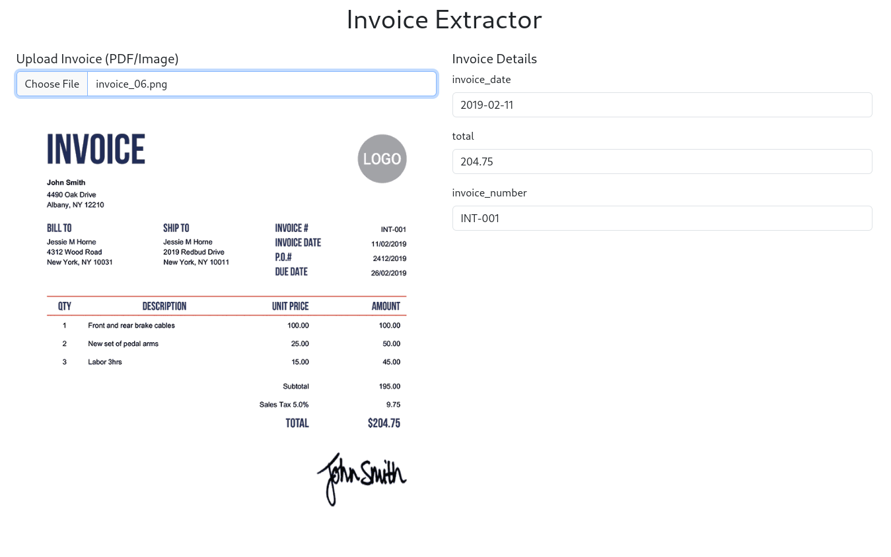
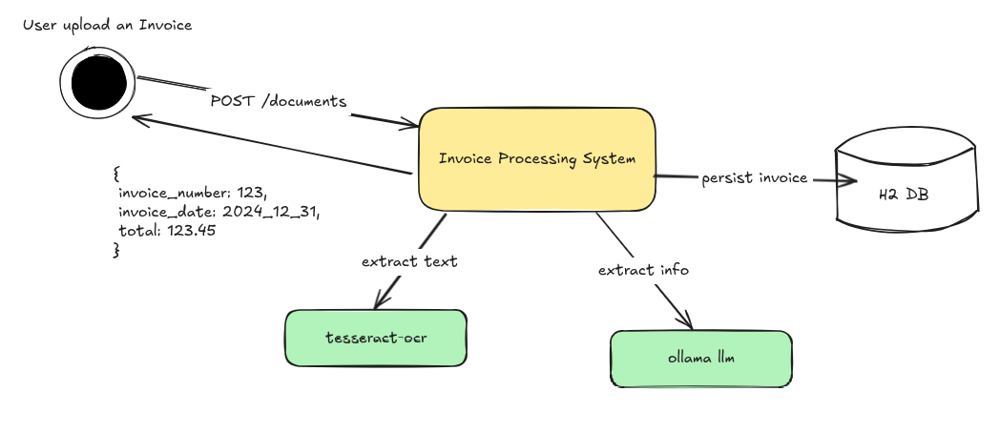

# Invoice processing System



#### Description:

Project to upload, processing and extract invoices information, such as Invoice Number, Invoice Date and Total Value.

The project runs on post 8080 and has a frontend made with Thymeleaf and a backend with spring.

The main page is acessible by `localhost:8080/` or `localhost:8080/index` and on this page the user can upload an image of an invoice.

There is a REST API mapped by the class **DocumentController**.

The upload occurs by calling the POST /documents and sending the image. And this endpoint will return the invoice's info, such as invoice number and date and the total value of the invocie.

The system gets the image and send to tesseract, an opensource OCR which is running locally, to extract the text from the image.

Then the program will call the Ollama API, also running locally, using a predefined prompt to extract the information as JSON.

There are another two methods on **DocumentController**, one to list all invoices and other method to detail an invoice by id.

Both methods only call the DocumentRepository to get the invoices from Database.

### Architecture



The APP use the H2 DB, an InMemory database to persist the invoices.

Tesseract OCR and Ollama are running locally.

## Setup

- Java > 17
- Kotlin
- Spring >3
- Thymeleaf for frontend.
- Tesseract (OCR)
- Ollama 3.1 small model (LLM)
- Maven

### Execute the project

```shell
mvn package && java -jar target/final.project-1.0.0.jar
```

### Install tesseract

[Tesseract-OCR](https://tesseract-ocr.github.io/tessdoc/InstallationOpenSuse.html)

### Install Ollama

[API Reference](https://github.com/ollama/ollama/blob/main/docs/api.md)
