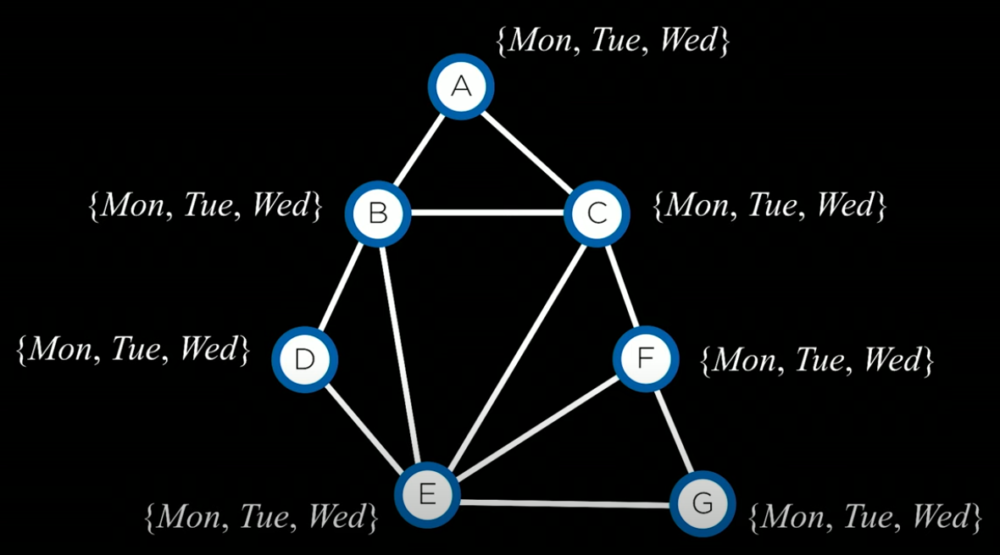

# Constraint Satifaction Problem

Problema de agendamento de provas. Cada node é prova de uma matéria e só pode ter uma prova entre segunda e quarta. As ligações correspondem materias que nao podem ter provas no mesmo dia.

Exemplo: A materia **A** nao pode ter prova no mesmo dia que **B** e **C**.



No [schedule.py](schedule.py) as provas são representadas pela VARIABLES.

As restrições são as CONSTRAINTS.

Os valores possiveis são o DOMAIN.

Ao executar o programa, terá a saida:

```sh
python schedule.py

{'A': 'Monday', 'B': 'Tuesday', 'C': 'Wednesday', 'D': 'Wednesday', 'E': 'Monday', 'F': 'Tuesday', 'G': 'Wednesday'}
```