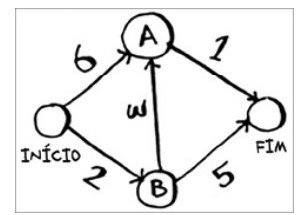
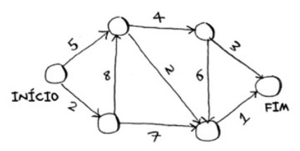
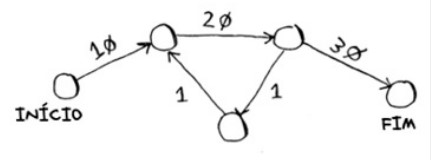

# Dijkstra 

Implementação do algoritmo de dijkstra para encontrar o menor caminho.

## Executar local

1. Build do projeto:
    ```sh
    mvn clean instal
    ```
2. Executar
    ```sh
    java -jar target/dijkstra-0.0.1-SNAPSHOT.jar
    ```

## Exemplos de teste

Na pasta `src/main/resources` há trÊs grafos de teste.

1. Exemplo 01:
    

1. Exemplo 02:
    

1. Exemplo 03:
    
