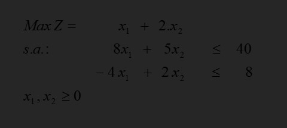
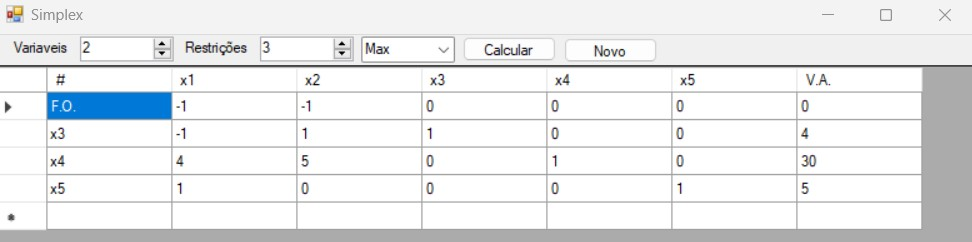
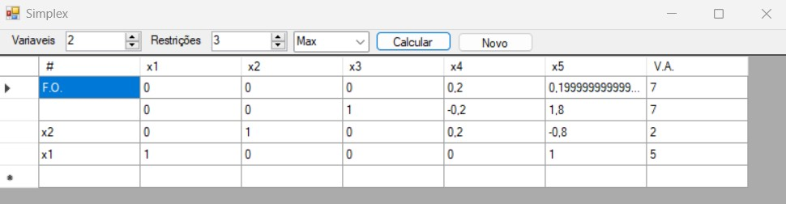

# Tableu Simplex

Programa para resolver problemas de maximização utilizando o algoritmo Simplex.

## Problema de exemplo:

1. Encontrar os valores de x1 e x2:

1. Encontrar a forma padrão para o problema:

1. Setar os valores no programa:

1. Solução

